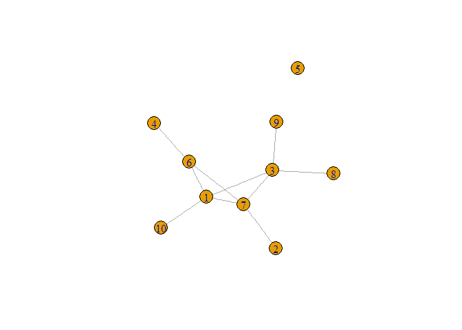
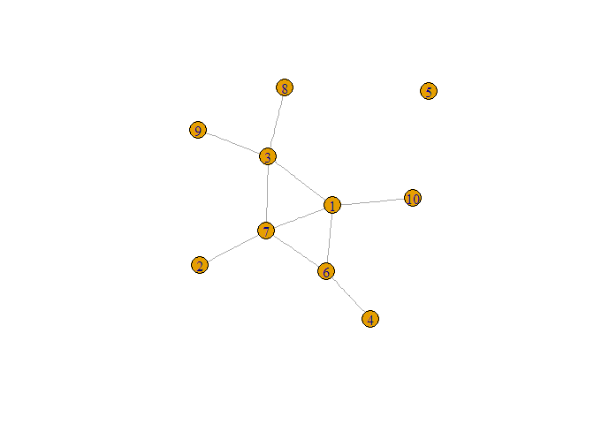
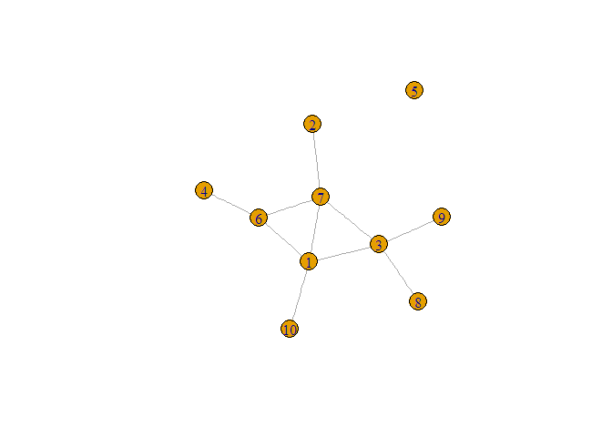
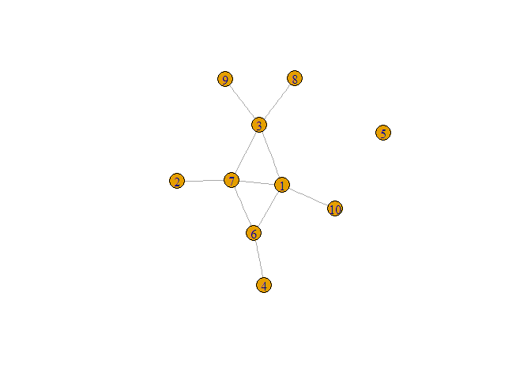

Remade\_for\_EONS
================
Lewis
12 October 2017

Preparing for network analysis
------------------------------

Using a network bypasses some of the usual steps in analysis. These steps are not rendered unnecessary: they now need to be anticipated.

    ## 
    ## Attaching package: 'igraph'

    ## The following objects are masked from 'package:stats':
    ## 
    ##     decompose, spectrum

    ## The following object is masked from 'package:base':
    ## 
    ##     union

### Missingness

Missing data can cause the analysis not to run. This is not such a problem, because it is detected. A bigger problem is when an analysis runs but doesn't do as expected. The inference, which is the point of the whole exercise, is then untrustworthy. It may be wrong or right, but it's untrustworthy.

A network is built of nodes and edges: this code builds a network with ten nodes and some edges, using a semi-random "game".The chances are that f and g below will be different.

    ## IGRAPH U--- 10 10 -- Erdos renyi (gnp) graph
    ## + attr: name (g/c), type (g/c), loops (g/l), p (g/n)
    ## + edges:
    ##  [1] 2-- 6 3-- 6 1-- 8 2-- 8 3-- 8 5-- 8 3-- 9 5--10 6--10 9--10

    ## IGRAPH U--- 10 10 -- Erdos renyi (gnp) graph
    ## + attr: name (g/c), type (g/c), loops (g/l), p (g/n)

    ## IGRAPH U--- 10 10 -- Erdos renyi (gnp) graph
    ## + attr: name (g/c), type (g/c), loops (g/l), p (g/n)
    ## + edges:
    ##  [1] 1-- 3 1-- 6 4-- 6 1-- 7 2-- 7 3-- 7 6-- 7 3-- 8 3-- 9 1--10

    ## IGRAPH U--- 10 10 -- Erdos renyi (gnp) graph
    ## + attr: name (g/c), type (g/c), loops (g/l), p (g/n)

The network that results can be visualised in lots of different ways. It looks a little different in each one. Each is nevertheless still a visualisation of the same network. There are algorithms for forcing the layout to take a certain form:

    ## png 
    ##   2

    ## png 
    ##   2

    ## png 
    ##   2

